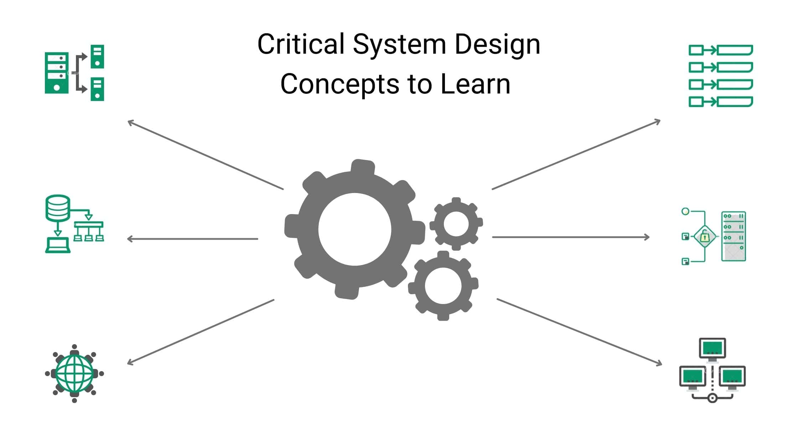
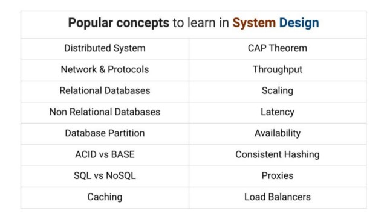
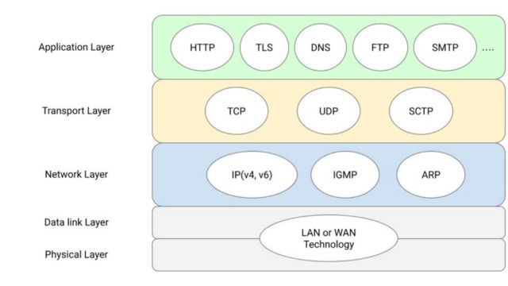
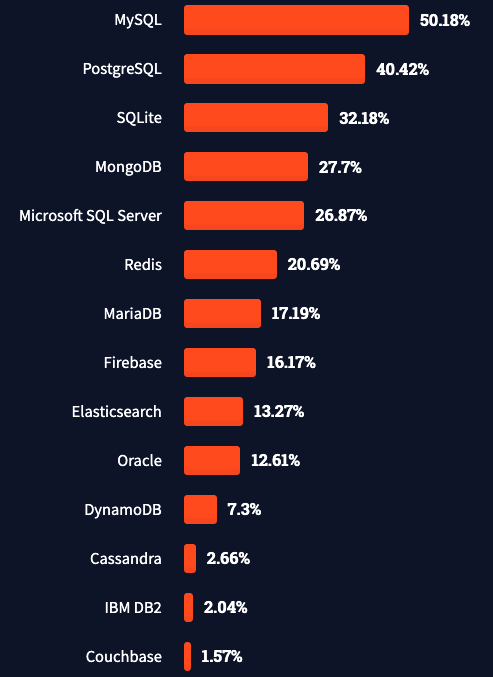

# Các Khái Niệm Phổ Biến Trong Thiết Kế Hệ Thống

Thiết kế hệ thống là một trong những chủ đề thiết yếu mà các công ty công nghệ lớn đặt ra trong quá trình phỏng vấn. Mặt khác, nó cũng cần thiết cho việc giải quyết các vấn đề phần mềm quy mô lớn.

Sau khi đọc bài viết này, bạn sẽ làm quen với khái niệm cơ bản liên quan đến thiết kế hệ thống. Hiểu rõ về các chủ đề này giúp bạn hiểu thiết kế hệ thống ở cấp độ nâng cao và giải quyết được các vấn đề của nó.

## Thiết kế hệ thống là gì?

Thiết kế hệ thống liên quan đến việc thiết kế một hệ thống đáp ứng các yêu cầu về chức năng và nghiệp vụ. Trong khi thiết kế, người ta cần cân nhắc nhiều sự đánh đổi khác nhau và lựa chọn giữa độ phức tạp và hiệu suất của hệ thống.
- Hiểu các nguyên tắc phổ biến, các tính năng chính và khuyết điểm của nó để đưa ra các quyết định sáng suốt.
- Tốt nhất là bạn nên có hiểu biết về khái niệm hay tất cả các thuật ngữ thiết yếu thường gặp phải trong thiết kế hệ thống. Chúng ta cần biết các khái niệm về khả năng mở rộng (ngang & dọc), bộ nhớ đệm, cân bằng tải, phân vùng dữ liệu, cơ sở dữ liệu, mạng, giao thức, sharding,... và nhiều thứ khác nữa

Tương tự, chúng ta cần cân nhắc sự cân bằng khi xem xét chức năng cốt lõi của ứng dụng mà chúng ta đang thiết kế. Tuỳ vào yêu cầu, chúng ta cần quyết định: độ trễ với thông lượng, hiệu suất với khả năng mở rộng, tính nhất quán với tính khả dụng, v.v.

Nhìn chung, thiết kế hệ thống là một chủ đề mở dành cho thảo luận. Đó là lý do tại sao hầu hết các công ty công nghệ hàng đầu thích có một hoặc hai vòng phỏng vấn thiết kế hệ thống. Bây giờ, chúng ta hãy đi sâu vào để làm quen với các chủ đề hoặc khái niệm cơ bản được sử dụng trong thiết kế hệ thống.

## Tính khả dụng

Tính khả dụng là một trong những cách đảm bảo độ tin cậy của hệ thống. Nó có nghĩa là hệ thống phải luôn hoạt động và trả lại phản hồi mỗi khi bất kỳ máy khách nào yêu cầu nó thực hiện bất kỳ hoạt động nào. Bất cứ khi nào người dùng tìm kiếm dịch vụ, nó phải sẵn sàng đáp ứng yêu cầu của người dùng.

Tính khả dụng có thể được định lượng bằng cách đo phần trăm thời gian mà các dịch vụ và chức năng của hệ thống vẫn hoạt động trong một khoảng thời gian nhất định. Chúng tôi thường xác định "tỷ lệ phần trăm khả dụng" cho các hệ thống theo số 9 phần trăm khả dụng, như được hiển thị trong bảng sau:

Tính khả dụng của dịch vụ thường được tăng lên cho dự phòng. Các bản sao thường được sử dụng để cung cấp phương án dự phòng bằng cách triển khai một bản sao của cùng một máy chủ để nếu một máy chủ gặp sự cố, nó sẽ không ảnh hưởng đến tính khả dụng của dịch vụ.

## Thông lượng

Thông lượng là tốc độ truyền hoặc dung lượng tối đa của hệ thống. Nó được sử dụng làm thước đo để xác định mức độ công việc mà hệ thống có thể thực hiện trong một khung thời gian nhất định. Thông lượng của hệ thống có thể được tăng lên bằng cách mở rộng quy mô hệ thống. Một cách đầy hứa hẹn nữa để tăng thông lượng của hệ thống là chia nhỏ các yêu cầu và phân phối chúng cho các tài nguyên khác nhau.

## Proxy

Proxy là người trung gian nằm giữa máy khách và máy chủ. Khi một máy khách gửi một yêu cầu, nó sẽ đi qua proxy và sau đó đến máy chủ. Proxy có hai loại: Forward Proxy và Reverse Proxy.

Forward Proxy hoạt động như một mặt nạ cho máy khách và ẩn danh tính của máy khách khỏi máy chủ, ví dụ: VPN. Tương tự, Reverse Proxy hoạt động như một mặt nạ cho máy chủ và ẩn danh tính của máy chủ khỏi phản hồi đi kèm, ví dụ: Load Balancer.

## Độ trễ

Độ trễ là khoảng thời gian mà hệ thống cần để tạo ra kết quả. Độ trễ là thước đo tốc độ của hệ thống. Độ trễ càng giảm, tốc độ của hệ thống càng cao.

## Giao thức mạng 

Hầu hết mọi hệ thống đều có sự phụ thuộc rất lớn vào mạng. Mạng hoạt động như một nền tảng để giao tiếp giữa người dùng và máy chủ hoặc giữa các máy chủ khác nhau. 

Ngược lại, giao thức là tập hợp các quy tắc chi phối cách các máy giao tiếp qua mạng. Một số giao thức mạng phổ biến nhất là HTTP, TCP/IP, ...

## Cơ sở dữ liệu

Cơ sở dữ liệu được sử dụng để lưu trữ. Mọi hệ thống đều được có một số lượng lớn dữ liệu cần được lưu trữ ở đâu đó để khi cần thiết,để  chúng có thể được tìm nạp dễ dàng và do đó cơ sở dữ liệu được sử dụng. Hầu hết cơ sở dữ liệu được phân loại thành cơ sở dữ liệu quan hệ và phi quan hệ.

**Cơ sở dữ liệu quan hệ (SQL)** là những cơ sở dữ liệu thực thi chặt chẽ mối quan hệ chặt chẽ giữa các bảng dữ liệu. Cơ sở dữ liệu quan hệ có cấu trúc cao về bản chất. Ví dụ: MySQL, PostgreSQL, ...

**Cơ sở dữ liệu phi quan hệ (NoSQL)** có cấu trúc linh hoạt, tức là chúng ít cứng nhắc hơn. Dữ liệu được lưu trữ theo cách phi cấu trúc và các cơ sở dữ liệu này thường được sử dụng trong các dịch vụ yêu cầu tốc độ cao và được phân phối tự nhiên. Ví dụ: Cassandra, Redis, ...

**Phân vùng cơ sở dữ liệu** là một khái niệm quan trọng khác được sử dụng để cải thiện độ trễ và thông lượng của dịch vụ để ngày càng có nhiều yêu cầu cần được giải quyết hơn. Sharding là cách chia cơ sở dữ liệu thành các phần nhỏ hơn để tăng hiệu suất của dịch vụ.

Danh sách các cơ sở dữ liệu phổ biến dựa trên Stack Overflow 2021.

## ACID vs BASE

Cơ sở dữ liệu quan hệ và cơ sở dữ liệu phi quan hệ đảm bảo các kiểu tuân thủ khác nhau. Cơ sở dữ liệu quan hệ được kết hợp với ACID, trong khi cơ sở dữ liệu phi quan hệ kết hợp với BASE.

### ACID: Atomicity, Consistency, Isolation, Durability

Chúng được coi là bốn thuộc tính quan trọng của một cơ sở dữ liệu quan hệ khi xử lý bất kỳ giao dịch nào. Nếu thiếu một trong những thuộc tính này thì tính toàn vẹn của cơ sở dữ liệu khó có thể được đảm bảo. 

Trong một cơ sở dư liệu quan hệ, một giao dịch là một đơn vị logic thao tác trên dữ liệu, có thể bao gồm nhiều thao tác. Chẳng hạn việc chuyển tiền từ tài khoản này sang tài khoản khác là một giao dịch, bao gồm thao tác trừ tiền một tài khoản và cộng tiền vào tài khoản kia. Các tính chất ACID trong trường hợp này sẽ đảm bảo các giao dịch được thực hiện một cách đáng tin cậy:
- **Tính nguyên tố (Atomicity)**. Một giao dịch có nhiều thao tác khác biệt thì hoặc là toàn bộ các thao tác hoặc là không một thao tác nào được hoàn thành. Chẳng hạn việc chuyển tiền có thể thành công hay trục trặc vì nhiều lý do nhưng tính nguyên tố bảo đảm rằng một tài khoản sẽ không bị trừ tiền nếu như tài khoản kia chưa được cộng số tiền tương ứng.
- **Tính nhất quán (Consistency)**. Một giao dịch hoặc là sẽ tạo ra một trạng thái mới và hợp lệ cho dữ liệu, hoặc trong trường hợp có lỗi sẽ chuyển toàn bộ dữ liệu về trạng thái trước khi thực thi giao dịch.
- **Tính độc lập (Isolation)**. Một giao dịch đang thực thi và chưa được xác nhận phải bảo đảm tách biệt khỏi các giao dịch khác.
- **Tính bền vững (Durability)**. Dữ liệu được xác nhận sẽ được hệ thống lưu lại sao cho ngay cả trong trường hợp hỏng hóc hoặc có lỗi hệ thống, dữ liệu vẫn đảm bảo trong trạng thái chuẩn xác.

### BASE: Basically Available Soft State Eventual Consistency

Cơ sở dữ liệu NoSQL phù hợp hơn nhiều để lưu trữ dữ liệu như nội dung bài viết, bài đăng trên các kênh media, dữ liệu cần kiểm duyệt và các loại dữ liệu phi cấu trúc khác khó mà xếp vừa trong một bảng. Cơ sở dữ liệu NoSQL được xây dựng với tính linh hoạt, khả năng mở rộng và tuân theo mô hình nhất quán BASE, có nghĩa là:

- **Tính khả dụng ở mức cơ bản (Basic Availability)**. Trong khi cơ sở dữ liệu đảm bảo tính khả dụng cho dữ liệu, cơ sở dữ liệu có thể không nhận được dữ liệu được yêu cầu, dữ liệu có thể ở trạng thái thay đổi hoặc không nhất quán.
- **Trạng thái mềm (Soft state)**. Trạng thái của cơ sở dữ liệu có thể thay đổi theo thời gian.
- **Tính nhất quán (Eventual consistency)**. Cơ sở dữ liệu sẽ trở nên nhất quán và dữ liệu sẽ được lan truyền khắp mọi nơi tại một thời điểm nào đó trong tương lai.

## SQL vs NoSQL

Trong khi thiết kế bất kỳ ứng dụng nào, người ta cần phải hiểu rõ về kiểu lưu trữ theo yêu cầu hệ thống. Nếu hệ thống phân tán cần tốc độ và khả năng mở rộng thì cơ sở dữ liệu No-SQL là lựa chọn tốt nhất để đi cùng. Cơ sở dữ liệu No-SQL cũng được ưu tiên hơn khi lượng dữ liệu rất lớn. Đồng thời, cơ sở dữ liệu SQL thuận lợi khi cấu trúc dữ liệu quan trọng hơn và thường được ưu tiên khi các truy vấn phức tạp hơn. Tuy nhiên, luôn có sự đánh đổi khi lựa chọn giữa cơ sở dữ liệu No-SQL và SQL. Do đó, đôi khi một kiến trúc hỗn hợp bao gồm cả cơ sở dữ liệu SQL và No-SQL được sử dụng để đảm bảo hiệu suất của ứng dụng.

## Mở rộng quy mô

Khi dịch vụ của bạn phát triển và ngày càng có nhiều yêu cầu đến với hệ thống, thì trong lúc đó, dịch vụ của bạn sẽ trở nên chậm và ảnh hưởng đến hiệu suất. Cách tốt nhất để giảm thiểu điều này là mở rộng quy mô, tức là tăng tiềm năng của hệ thống. Có hai cách để làm như vậy: mở rộng theo chiều ngang và mở rộng theo chiều dọc.

Mở rộng theo chiều ngang có nghĩa là mở rộng dịch vụ bằng cách thêm nhiều máy chủ hơn vào các ứng dụng của bạn để phân phối các yêu cầu. Còn, mở rộng theo chiều dọc tương ứng với việc tăng công suất hoặc năng lực của cùng một máy bằng cách nâng cấp phần cứng máy để xử lý  nhiều lưu lượng truy cập.

## Caching

Bộ nhớ đệm (caching) đảm bảo hiệu suất và giúp giảm độ trễ của hệ thống. Để làm cho ứng dụng của chúng ta nhanh hơn, thuận tiện để lưu trữ một số dữ liệu thường dùng và truy cập trong thời gian ngắn hơn để đảm bảo tốc độ của hệ thống. Bộ nhớ đệm được sử dụng để lưu trữ các phần dữ liệu nhất định này, vì vậy thay vì truy vấn cơ sở dữ liệu, dữ liệu có thể dễ dàng được tìm nạp từ bộ đệm. Tuy nhiên, với việc bổ sung bộ nhớ đệm, độ phức tạp của hệ thống sẽ tăng lên. Điều tối cần thiết là duy trì đồng bộ hóa giữa dữ liệu được lưu trữ trong ổ đĩa và bộ đệm để hệ thống phải có tính nhất quán. Hơn nữa, với dung lượng giới hạn của các bộ nhớ đệm ta cần các thuật toán loại bỏ dữ liệu khác nhau như LIFO, FIFO, LRU, LFU, ..., được sử dụng để đảm bảo hiệu suất của dịch vụ.

## Hệ thống phân tán

Một hệ thống phân tán tập hợp nhiều máy độc lập hoạt động cùng nhau bằng cách phối hợp với nhau để đạt được một mục tiêu chung. Hệ thống phân tán hoạt động theo cách mà nó xuất hiện như một thực thể duy nhất đối với người dùng bên ngoài. Hệ thống phân tán hoạt động đồng thời và có khả năng mở rộng cao. Ngày nay hệ thống phân tán là một nhu cầu thiết yếu với hầu hết mọi ứng dụng đều dựa trên tính toán phân tán. Hệ thống phân tán có khả năng mở rộng cao, đáng tin cậy và cung cấp các dịch vụ có độ trễ thấp.

## Băm nhất quán

Bắn nhất quán là khái niệm được sử dụng rộng rãi nhất trong hệ thống phân tán vì nó mang lại sự linh hoạt đáng kể trong việc mở rộng quy mô của ứng dụng. Băm nhất quán là một cải tiến so với băm thông thường. Phương pháp băm truyền thống không hiệu quả trong việc xử lý các yêu cầu qua mạng. Với băm nhất quán, người dùng và máy chủ được đặt trong một cấu trúc vòng tròn được gọi là Hash ring. Vòng được coi là vô hạn và có thể chứa bất kỳ số lượng máy chủ nào và gán vị trí ngẫu nhiên cho các máy chủ dựa trên một số hàm băm. Khái niệm này cho phép phân phối các yêu cầu hoặc dữ liệu ánh xạ của chúng đến các máy chủ một cách hiệu quả. Nó giúp đạt được khả năng mở rộng theo chiều ngang và tăng thông lượng và độ trễ của ứng dụng.

## Định lý CAP

Định lý CAP là một định lý được áp dụng trong lý thuyết khoa học máy tính. Còn có tên là Định lý của Brewer sau khi nhà khoa học Eric Brewer, nói rằng không thể lưu trữ dữ liệu phân tán đồng thời cung cấp hơn hai trong số ba yếu tố sau đây[1]

- Tính nhất quán: Mỗi lần đọc dữ liệu, sẽ nhận được nội dung mới nhất hoặc lỗi.
- Tính khả dung: Mỗi lần đọc dữ liệu, sẽ nhận được nội dung mới nhất hoặc lỗi	

