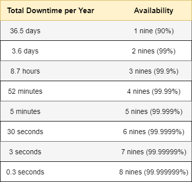
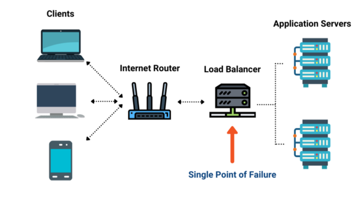

# Tính Khả Dụng

Tính khả dụng là một khái niệm được đề cập nhiều nhất trong các câu hỏi phỏng vấn thiết kế hệ thống. Nhiều người trong chúng ta có thể đã trải qua những khoảnh khắc mà chúng ta không thể truy cập một ứng dụng nhất định do ngừng hoạt động hoặc không có sẵn. Gần đây, YouTube phải đối mặt với sự cố ngừng hoạt động toàn cầu khiến người dùng không thể phát video trong khoảng một giờ. Bạn có thể tự hỏi lý do đằng sau nó và Làm thế nào người ta có thể ngăn nó xảy ra? Hãy cùng tìm hiểu.

## Tính khả dụng là gì?

Tính khả dụng là tỉ lệ phần trăm trong một khoảng thời gian nhất định mà một hệ thống khả dụng để thực hiện các tác vụ và chức năng của nó trong điều kiện bình thường. Tỷ lệ khả dụng mà hệ thống yêu cầu phụ thuộc vào logic nghiệp vụ hoặc cách sử dụng hệ thống. Hãy lấy một số ví dụ. 

Hệ thống kiểm soát không lưu là một trong những ví dụ điển hình về các hệ thống yêu cầu **tính khả dụng cao**. Trong thế giới ngày nay, việc di chuyển bằng đường hàng rất phổ biến, một sai sót trong việc điều khiển máy bay có thể dẫn đến một kết quả thảm khốc.

Ngược lại, một hệ thống có ít người truy cập và không dễ bị hỏng hóc nghiêm trọng thì yêu cầu tính khả dụng ít hơn một chút. Tính khả dụng cao đi kèm với chi phí, vì vậy chúng ta phải tối ưu hóa theo nhu cầu của mình.

## Tính khả dụng được đo lường như thế nào?

Tính khả dụng của hệ thống được đo bằng phần trăm thời gian hoạt động của hệ thống trong một khoảng thời gian nhất định hoặc bằng cách chia tổng thời gian hoạt động cho tổng thời gian hoạt động cộng với thời gian ngừng hoạt động trong một khoảng thời gian nhất định.

**Tính khả dụng = Thời gian hoạt động ÷ (Thời gian hoạt động + thời gian ngừng hoạt động)**

### Sự khả dụng của số 9

Tính khả dụng cũng có thể được thể hiện dưới con số **9**. Trong các ứng dụng có nhu cầu cao, chúng ta thường đo lường tính khả dụng theo con số 9 hơn là tỷ lệ phần trăm. Nếu tính khả dụng là 99,00 phần trăm, nó được cho là có "2 nines" khả dụng và nếu nó là 99,9 phần trăm, nó được gọi là "3 nines"... Hệ thống có 5 nines (tức là 99,999%) khả dụng được cho là đạt tiêu chuẩn vàng về tính khả dụng. Chúng ta hãy xem bảng dưới đây.

Tính khả dụng cao luôn có sự đánh đổi của nó, chẳng hạn như độ trễ cao hơn hoặc thông lượng thấp hơn và việc đạt được tính khả dụng cao là rất khó. Chúng ta cần xem xét sự cân bằng mà chúng ta cần thực hiện dựa trên hệ thống của chúng ta.

Để tạo ra các hệ thống có tính khả dụng cao, chúng ta cần đảm bảo rằng hệ thống không có bất kỳ SPOF nào. SPOF - Single point of failure, một điểm lỗi duy nhất trong hệ thống là điểm có thể dẫn đến sự cố sập toàn hệ thống.

Vậy, làm thế nào để chúng ta loại bỏ một điểm lỗi duy nhất trong một hệ thống?
Để loại bỏ bất kỳ điểm lỗi nào, chúng ta cần tạo cho hệ thống của chúng ta nhiều dự phòng hơn. Dự phòng là hành động sao chép hoặc thêm một số phần nhất định trong hệ thống. Hãy lấy một ví dụ; hãy tưởng tượng bạn có một hệ thống bao gồm hai máy chủ web dự phòng giống hệt nhau được cài đặt phía sau bộ cân bằng tải. Lưu lượng đến từ các máy khách sẽ được phân phối giữa các máy chủ web, nhưng nếu một trong các máy chủ gặp sự cố, bộ cân bằng tải sẽ chuyển hướng tất cả lưu lượng đến máy chủ còn lại, hệ thống vẫn hoạt động.

Bây giờ chúng ta đã tạo dự phòng cho máy chủ của mình và bộ cân bằng tải có thể phát hiện lỗi và phản hồi phù hợp. Tuy nhiên, trong trường hợp này, bản thân bộ cân bằng tải vẫn là điểm lỗi duy nhất. Để tránh điều này, một cách đơn giản là tạo dự phòng cho lớp cân bằng tải.

Một điều quan trọng cần lưu ý ở đây là chỉ dự phòng không thể đảm bảo tính khả dụng cao. Một thiết bị cũng cần có các cơ chế để phát hiện các hư hỏng. Điều quan trọng nữa là có thể thực hiện kiểm tra tính khả dụng cao và có thể thực hiện hành động khắc phục bất cứ khi nào một trong các thành phần của hệ thống không khả dụng. Các phương pháp tiếp cận tính khả dụng cao từ trên xuống dưới hoặc phân tán có thể bao gồm cả công việc về phần cứng, hoặc các kỹ thuật giảm thời gian chết dựa trên phần mềm.

Dự phòng là một cách tiếp cận dựa trên phần cứng. Mặt khác, việc thực hiện các kỹ thuật khả dụng cao, hầu như luôn luôn yêu cầu phần mềm.

- Dự phòng thụ động: Khi bạn có nhiều thành phần tại một lớp nhất định trong hệ thống của mình và nếu tại bất kỳ thời điểm nào, một trong số chúng sập, các máy chủ còn lại sẽ tiếp quản và ngăn chặn bất kỳ lỗi nào.
- Dự phòng chủ động: Khi bạn có nhiều máy hoạt động cùng nhau, chỉ một hoặc một số máy thường xử lý lưu lượng truy cập hoặc thực hiện công việc. Nếu một trong số chúng bị lỗi, các máy khác sẽ biết bằng cách nào đó và sau đó tiếp quản.

## Sự khác biệt giữa tính khả dụng cao và khả năng chịu lỗi

Cả tính khả dụng cao và khả năng chịu lỗi đều áp dụng cho các phương pháp cung cấp mức thời gian hoạt động cao. Tuy nhiên, các phương pháp chịu lỗi và tính sẵn sàng cao sẽ hoàn thành mục tiêu theo cách khác.

Tính toán có khả năng chịu lỗi yêu cầu dự phòng phần cứng đầy đủ. Để đạt được khả năng chịu lỗi, một số hệ thống chạy song song, sao chép các chương trình giống nhau và thực hiện các lệnh cùng nhau. Nếu
hệ thống chính bị lỗi, không mất thời gian hoạt động, hệ thống khác có thể đảm nhận.

Sẽ là tốt nhất nếu bạn có phần cứng tiên tiến để đạt được khả năng chịu lỗi của máy tính. Nó phải có khả năng phát hiện các lỗi thành phần ngay lập tức và cho phép các hệ thống khác nhau hoạt động cùng lúc.

Dạng máy này bảo toàn bộ nhớ và bản ghi của chương trình, một ưu điểm chính. Tuy nhiên, có thể mất nhiều thời gian hơn đối với các mạng và thiết bị phức tạp hơn khi gặp sự cố. Trong khi đó, các vấn đề kỹ thuật gây ra sự cố hệ thống cũng có thể gây ra sự cố tương tự đối với các hệ thống dự phòng đang chạy song song, tạo ra sự cố trên toàn hệ thống.

Thay vào đó, chiến lược giá trị cao sử dụng phương pháp dựa trên phần mềm để giảm thiểu thời gian ngừng hoạt động của máy chủ thay vì phương pháp dựa trên phần cứng. Một cụm màn hình cao tìm thấy một tập hợp các máy chủ cùng nhau thay vì sử dụng phần cứng vật lý để đạt được khả năng dự phòng tối đa.