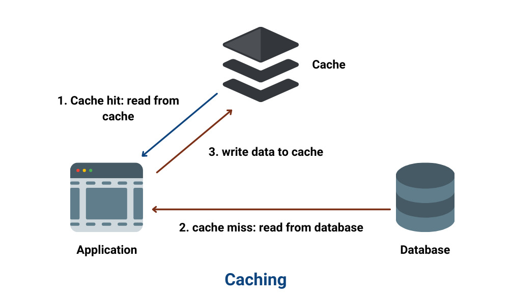
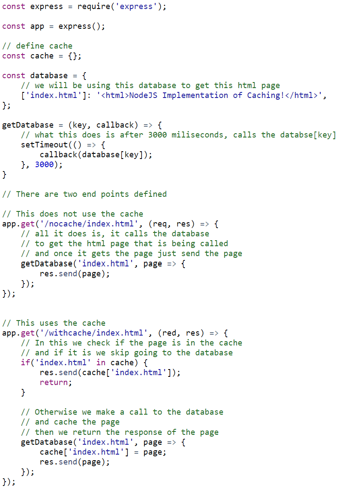
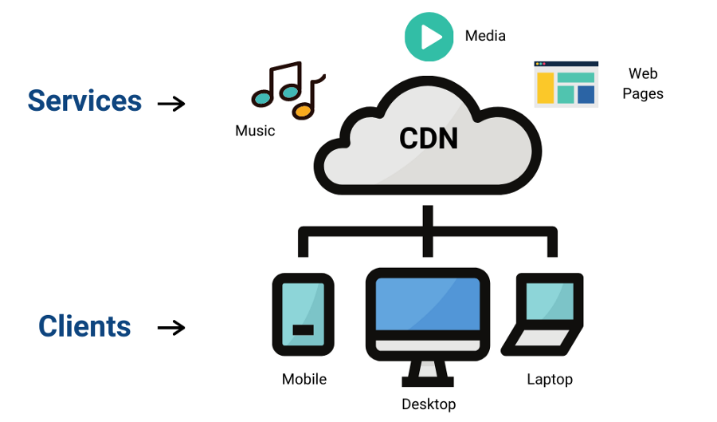
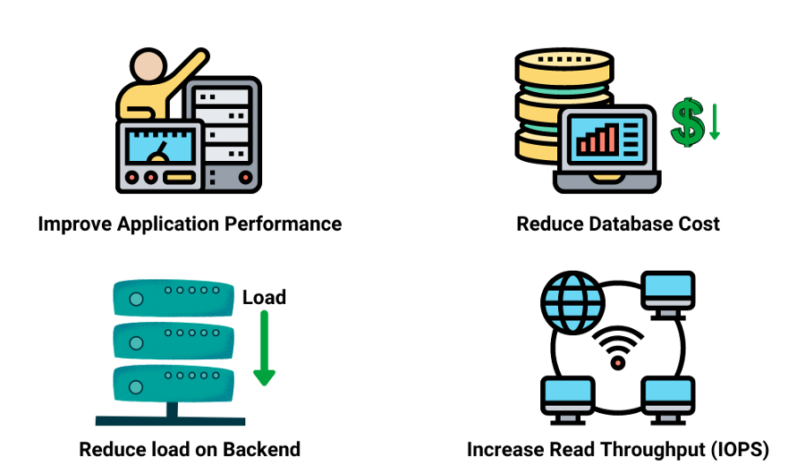

# Các Khái Niệm Trong Thiết Kế Hệ Thống: Caching

Trong bài viết lần này, ta sẽ học về caching, một khái niệm cơ bản và quan trọng trong thiết kế hệ thống. Nếu tinh tế bạn sẽ thấy khi bạn vừa đóng một trang web và rồi lại mở lại ngay sau đó, thì nó không mất thời gian tải trang như ban đầu? Điều gì đã xảy ra? **Hãy cùng tìm hiểu nhé**

## Caching là gì?

Caching là quá trình lưu trữ kết quả của một yêu cầu ở một ví trí khác với vị trí ban đầu, hay có thể nói là lưu trữ yêu cầu ở bộ nhớ tạm thời để tránh thực hiện lại các thao tác giống nhau. Về cơ bản, cache là một bộ nhớ tạm thời nhằm mục đích truy cập dữ liệu nhanh hơn.

**Ví dụ**

- Cache của trình duyệt web lưu lại ảnh, HTML, CSS và JS để truy cập nhanh hơn khi được gọi lại.
- CDN lưu trữ các file tĩnh để giúp giảm độ trễ.
- DNS sử dụng để lấy địa chỉ IP của truy vấn. Như khi một yêu cầu địa chỉ IP nhiều lần, nó có thể được lưu vào cache, cho phép tả thực hiện truy vấn DNS lại, và trang web có thể được truy cập nhanh hơn.

## Thế giới thực

Ta lấy ví dụ như một người thủ thư để hiểu ý tưởng cơ bản đằng sau thiết kế của cache. Tương tượng một thư viện với 1000 quyển sách, và người thủ thư ngồi ở một cái bàn đảm nhiệm việc lấy sách theo yêu cầu từ kho của thư viện. Đầu tiên, ta bắt đầu với một thủ thư (không dùng cache).

Ở ngày đầu, một khách hàng đến. Anh ấy yêu cầu một quyển sách A, thủ thư đến phòng lưu trữ tìm sách, đặt nó ra bàn, và giao cho khách hàng. Vài ngày sau, người khác đó trả sách, thủ thư đặt lại sách vào chỗ của nó và quay lại tiếp tục công việc. Bây giờ, khi một khách hàng khác đến hỏi cùng lại quyển sách A đó. Thủ thư phải một lần nữa đến phòng lưu trữ, tìm sách và giao lại cho khách hàng. Trong hệ thống này, thủ thư đến kho lưu trữ bất cứ khi nào có khách hàng đến - bất kể lấy sách là một yêu cầu thường xuyên.

Bây giờ, ta thử đặt một cái túi vào bàn của thủ thư, cái túi này có thể chứa được 15 quyển sách (tương tự như cache). Trong túi này, thủ thư để vào những quyển sách được trả về gần nhất. Bây giờ, khách hàng đầu tiên đến và yêu cầu quyển sách A, thủ thư tìm ở kho lưu trữ và giao cho khách hàng. Sau đó, khi khách hàng trả sách thay vì đặt lại ở kho lưu trữ trữ, thủ thư giữ lại nó ở túi. Khi khách hàng khác đến và yêu cầu cùng quyển sách A, thủ thư kiểm tra trong túi và giao nó ngay cho khách hàng. Người thủ thư không phải mất thời gian cho chạy đến kho lưu trữ, nhờ đó mà khách hàng được phục vụ tốt hơn.

## Triển khai cache với Node.js

Triển khai một hệ thống cache đơn giản như sau:

Đầu tiên, ta sẽ tạo một server đơn giản và một cơ sở dữ liệu. Ta sẽ sử dụng cơ sở dữ liệu để lấy một trang HTML và server tải trang cục bộ. Ta sẽ tạo hai endpoint, một sử dụng cache và cái kia thì không.

**Caching.js**

Theo dõi trên trình duyệt, server với endpoint không có cache sẽ mất 3s để tải trang (vì ta dùng `setTimeout` để tải trang không dùng cache trong 3s). Nếu bạn tải lại trang, nó vẫn sẽ mất 3s để tải trang. Bất cứ khi nào bạn tải lại, nó vẫn phải đến cơ sở dữ liệu để tìm nạp và nó vẫn sẽ mất 3s.

Bây giờ, với endpoint sử dụng cache, lần đầu tiên nó mất 3s để tải trang vì cache đang trống và phải đến cơ sở dữ liệu để nạp. Nhưng ở các lần tiếp theo, nó tải về ngay lập tức, vì dữ liệu giờ đã ở cache và không phải đến cơ sở dữ liệu. 

## Chính sách hết hạn cache

Ta cần xoá các mục đã cũ để làm mới tài nguyên khi cache đầy. Ở đây, một trong những phương pháp phổ biến nhất là xoá các mục ít được dùng gần đây nhất. Giải pháp phải tối ưu xác suất xử lý yêu cầu của cache.

- **Random Replacement (RR)**: Phương pháp này ta xoá các mục một cách ngẫu nhiên
- **Least Frequently Used (LFU)**: Ta có thể đếm tần suất yêu cầu của các mục và xoá đi các mục có tần suất ít nhất.
- **Least Recently Used (LRU)**: Ta sẽ xoá các mục ít được dùng gần đây nhất.
- **First In First Out (FIFO)**: giải thuật FIFO giữ các đối tượng trong một hàng đợi, theo trật tự này đối tượng được tải vào cache. Một hoặc nhiều đối tượng bị xoá khỏi đầu khi cache đầy và thêm đối tượng mới vào cuối hàng đợi.

## Các cách tiếp cận caching khác

### Application server cache

Ta có thể lưu dữ liệu vào cache trực tiếp ở tầng Application. Bất cứ khi nào một yêu cầu đến dịch vụ, nó sẽ trả về dữ liệu cache ở cục bộ nhanh hơn (nếu có). Còn không, nó sẽ truy vấn dữ liệu từ cơ sở dữ liệu.

### Global caches

Ở cache toàn cục, không gian cache đơn giống nhau được dùng cho tất cả các nút. Mỗi nút ứng dụng sẽ truy vấn cache theo cách giống nhau như một nút cục bộ.

### Distributed cache

Cache thường bị tách ra vì sử dụng thuật toán băm nhất quán, và mỗi nút của nó là một phần của dữ liệu cache. Nếu một nút yêu cầu đang tìm kiếm một phần dữ liệu, nó có thể dễ dàng sử dụng hàm băm để lưu trữ thông tin từ cache phân tán để quyết định nếu dữ liệu khả dụng.

### CDN

Khi trang web của bạn cung cấp một lương lớn tài nguyên tĩnh, thì CDN là lựa chọn tốt nhất. Giả sử 

## Cache Invalidation

Cache có thể vô hiệu nếu dữ liệu bị thay đổi trong cơ sở dữ liệu. Nếu không, điều này dẫn đến các hành động không nhất quán. Có 3 kiểu hệ thống chính cho caching:

## Lợi ích của Caching

- **Cải thiện hiệu suất ứng dụng:** caching dùng cho cải thiện hiệu suất hệ thống và độ trễ API.
- **Giảm chi phí cơ sở dữ liệu:** caching chuyển lưu lượng truy cập sang server cache và giảm lưu lượng đến cơ sở dữ liệu, điều này giảm chi phí cho cơ sở dữ liệu.
- **Giảm tải cho backend:** giảm tải các yêu cầu giống nhau từ server chính đến server caching giúp giảm tải cho backend.
- **Tăng thông lượng đọc (IOPS):** phản hồi từ server cache nhanh hơn so với server chính, nó giúp tăng thông lượng đọc..

# Nguồn 

[enjoyalgorithms](https://www.enjoyalgorithms.com/blog/caching-system-design-concept)