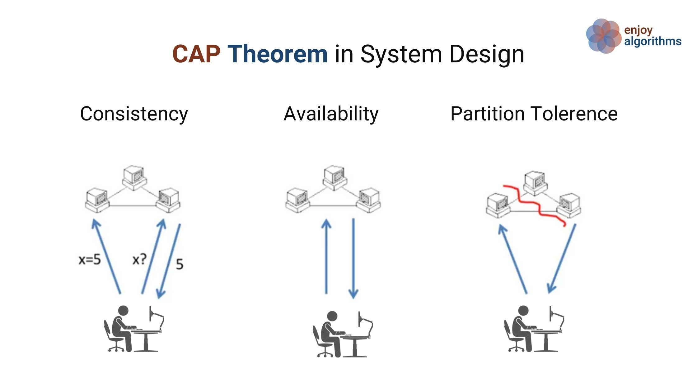

# Định lý CAP

Định lý CAP là một khái niệm quan trọng trong các hệ thống phân tán. Trong bài viết này, ta sẽ xem qua tất cả khái niệm liên quan đến định lý CAP và ứng dụng của nó cho các hệ thống khác nhau. Trước tiên ta sẽ hiểu sâu vào các khái niệm cốt lỗi đằng sau định lý CAP.

## Định lý CAP là gì?

Định lý CAP là một khái niệm cốt lõi cần thiết cho thiết kế các hệ thống chia sẽ dữ liệu qua mạng. Nó nói rằng một hệ thống cơ sở dữ liệu phân tán chỉ có thể đạt được hai trong ba chức năng: **tính nhất quán**, **tính khả dụng** và **dung sai phân vùng**. Ta có thể cân bằng hai trong ba chức năng dựa trên các trường hợp duy nhất cho hệ thống của ta.

## Các khái niệm chính

Trong một hệ thống phân tán, ta cần lưu trữ dữ liệu qua nhiều nút và giao tiếp đồng thời qua mạng. Vì 