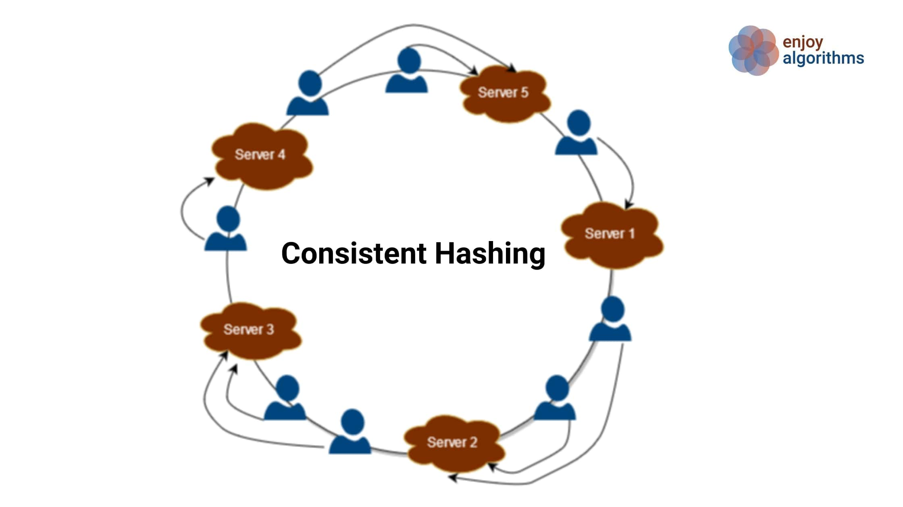
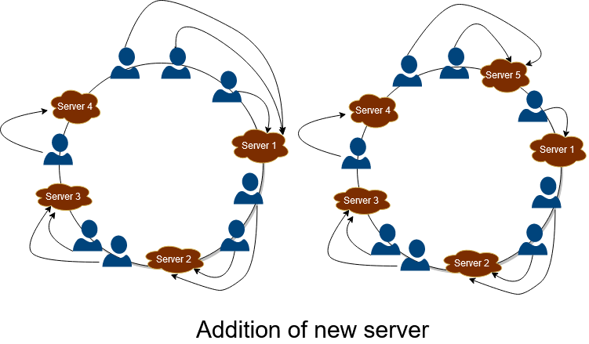
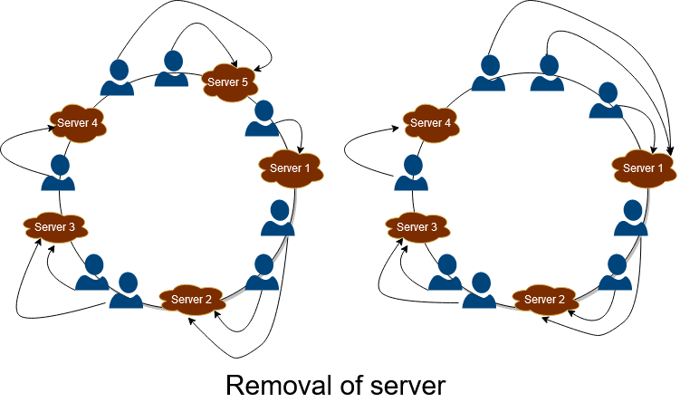
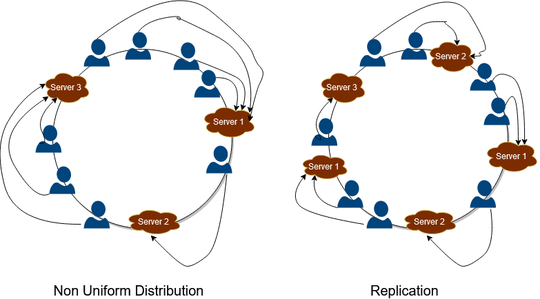

# Băm nhất quán

Blog này thảo luận về các khái niệm và cách tiếp cận chính có ích khi mở rộng hệ thống lưu trữ phân tán. Băm nhất quán có lợi và thường xuyên được áp dụng để giải quyết các thách thức khác nhau liên quan đến hệ thống và hữu ích trong Phỏng vấn thiết kế hệ thống. Nó cũng hữu ích để giảm bớt sự tắc nghẽn trong khi thiết kế bất kỳ hệ thống back-end nào và mở rộng quy mô ứng dụng.

## Băm nhất quán là gì?

Trước khi tìm hiểu sâu hơn về Băm nhất quán, trước tiên chúng ta hãy hiểu Băm là gì? Băm là một cách truy xuất thông tin hiệu quả về mặt tính toán và hữu ích trong việc nâng cao hiệu suất của các chương trình khác nhau. Trong băm, một hàm băm thường được sử dụng để ánh xạ thông tin đến một nhóm lưu trữ bằng cách tạo ra một giá trị băm bằng cách sử dụng một logic được xác định rõ ràng.

Ví dụ: chúng tôi có thể tạo một số ngẫu nhiên có thể ánh xạ đến bộ nhớ bằng cách sử dụng mod sử dụng tổng số máy chủ. Do đó, hàm băm được sử dụng để ánh xạ các yêu cầu tới các máy chủ khác nhau và hoàn thành công việc. Tuy nhiên, khái niệm này chỉ hợp lệ khi các máy chủ không thay đổi và vị trí bộ nhớ được xác định. Hệ thống phân tán thường liên quan đến việc thay đổi các máy chủ bên dưới để xử lý các yêu cầu qua mạng. Do đó, để đối phó với những thiếu sót như vậy của các hệ thống phân tán và xử lý các yêu cầu qua mạng, chúng ta cần một cách xử lý và tổ chức các yêu cầu hiệu quả hơn cho một ứng dụng có thể mở rộng. Điều này được đền bù bằng cách sử dụng băm nhất quán.

Băm nhất quán là một cải tiến so với Băm thông thường. Ở đây, người dùng và các máy chủ hầu như được đặt trong một cấu trúc vòng tròn được gọi là Hash ring. Vòng được coi là vô hạn và có thể chứa bất kỳ số lượng máy chủ nào có / không có phân bổ cố định và gán chúng cho các vị trí ngẫu nhiên dựa trên một số hàm băm.

## Tại sao chúng ta cần Băm nhất quán?

Phương pháp băm truyền thống rất kém hiệu quả để sử dụng và xử lý các yêu cầu qua mạng. Phương pháp cổ điển này giả định rằng chúng ta có một số lượng máy chủ cố định và tất cả vị trí ánh xạ đã được biết trước. Điều kiện này khá khó khăn trong việc xử lý các hệ thống phân tán nơi nhiều người dùng đang yêu cầu nhiều máy chủ. Nếu trong trường hợp một số máy chủ gặp sự cố, thì để ánh xạ công việc đến các máy chủ khác nhau, nó đòi hỏi tính toán lớn và nặng, rất kém hiệu quả và ảnh hưởng đến thông lượng của dịch vụ và làm tăng độ trễ của ứng dụng.

Trong hệ thống phân tán, nhiều nút tiếp tục tương tác với nhau. Giả sử chúng ta có năm nút trong hệ thống và lưu lượng truy cập tăng đột biến, và để giải quyết điều này, chúng ta phải thêm nhiều nút vào hệ thống. Giả sử chúng tôi đã thêm hai nút nữa, làm cho tổng số nút là bảy. Nếu chúng ta đang sử dụng hàm băm thông thường, chúng ta đã tính toán lại ánh xạ các yêu cầu như trước đây chúng ta sử dụng hàm băm bằng cách sử dụng năm nút, nhưng bây giờ chúng ta có bảy nút. Tương tự, trong trường hợp bảo trì hoặc thất bại, số lượng các nút giảm đi và do đó chúng ta cần phải tính toán lại ánh xạ, điều này thực sự rất kém hiệu quả.

Do đó, trong các tình huống khi chúng tôi không chắc chắn về số lượng máy chủ đang hoạt động tại bất kỳ thời điểm nào, chúng tôi không thể sử dụng phương pháp băm cổ điển vì điều này đòi hỏi nhiều tính toán dự phòng và cấu trúc lại dữ liệu hoặc yêu cầu xung quanh cụm. Hơn nữa, khi số lượng máy chủ tăng lên, thì cách tiếp cận này ngày càng trở nên kém hiệu quả hơn vì sẽ có ngày càng nhiều việc tính toán lại và phân công lại các yêu cầu cho các nút còn lại.

Chúng tôi cần một số cách năng động để giảm thiểu tất cả những thiếu sót này, và do đó ý tưởng về Bắn nhất quán ra đời.

## Băm nhất quán hoạt động như thế nào?

Băm nhất quán giúp chúng tôi tổ chức và phân phối tài nguyên hiệu quả bằng cách đảm bảo sắp xếp lại tối thiểu các yêu cầu hoặc người dùng trong bất kỳ trường hợp thất bại nào. Trong Băm nhất quán, một hàm băm được sử dụng để ánh xạ máy chủ đến các vị trí trong một vòng ảo. Vị trí của máy chủ chỉ là một vị trí ngẫu nhiên có được bằng cách sử dụng hàm băm. Băm nhất quán được tổ chức theo cách sau:

1. Các máy chủ được băm bằng cách sử dụng địa chỉ IP của chúng và được chỉ định vị trí dựa trên chức năng băm.
2. Tương tự, các phím được băm đến các vị trí sử dụng cùng một hàm băm và được đặt trong vòng ảo.
3. Ánh xạ các khóa với máy chủ có cùng vị trí và trong trường hợp vị trí không khớp, hãy gán khóa cho máy chủ đầu tiên mà chúng tôi nhận được khi di chuyển theo chiều kim đồng hồ.

Do đó, theo cách này, các khóa được gán cho máy chủ trong Bắn nhất quán. Vẻ đẹp của Bắn nhất quán xuất hiện khi chúng tôi thêm hoặc xóa các máy chủ.

## Bổ sung máy chủ mới

Khi một máy chủ mới được thêm vào ứng dụng, nó sẽ được ánh xạ bằng cách sử dụng hàm băm và được phân bổ đến vị trí mong muốn của vòng băm. Sau khi phân bổ, tất cả các khóa sẽ ánh xạ trên các máy chủ mới được thêm vào này đi qua vị trí của nó. Điều này được mô tả trong hình bên dưới. Khi máy chủ 5 được thêm vào giữa 1 và 4, tất cả các yêu cầu sau 4 được chỉ định cho 5 thay vì ánh xạ tới 1. Do đó, theo cách này, Bắn nhất quán giúp giảm tải các máy chủ lớn và chứng minh hiệu quả cao trong việc mở rộng và tăng thông lượng, đồng thời cải thiện độ trễ của ứng dụng.

## Xóa máy chủ

Bất cứ khi nào bất kỳ máy chủ nào bị lỗi trong hệ thống, thì tất cả các khóa được ánh xạ trước đó tới máy chủ bị lỗi sẽ chuyển hướng đến máy chủ tiếp theo, được đặt sau máy chủ bị lỗi theo chiều kim đồng hồ. Do đó, theo cách này, dịch vụ vẫn hoạt động và cung cấp dịch vụ có khả năng chịu lỗi. Điều này được mô tả trong hình bên dưới. Khi máy chủ 4 gặp sự cố, thì tất cả các khóa được ánh xạ tới 4 sẽ được phân bổ lại thành 1, ngăn hệ thống bị hỏng.

## Phân phối không đồng nhất

Có một thiếu sót của cách tiếp cận này. Tất cả các khóa có thể được ánh xạ tới cùng một máy chủ và do đó một máy chủ sẽ nhận tất cả khối lượng công việc và tất cả các máy chủ khác sẽ không hoạt động. Tình huống này rất kém hiệu quả và rất dễ bị thất bại. Để giải quyết vấn đề này, một khái niệm mới đã được đưa ra. Tất cả các máy chủ được sao chép và sắp xếp ở các vị trí khác nhau trong võ đài. Theo cách này, với số lượng máy chủ tăng lên, việc phân phối trở nên đồng đều hơn nhiều và giúp mở rộng dịch vụ. Điều này được mô tả trong hình bên dưới. Tất cả các máy chủ được sao chép và phân bổ đến các vị trí khác nhau, và do đó điều này làm cho việc phân bổ các khóa đồng nhất trong vòng băm.

## Kết luận

Bắn nhất quán là một trong những khái niệm quan trọng nhất trong việc thiết kế hệ thống phân tán vì nó giải quyết các thách thức về khả năng mở rộng với việc gán các nút động và cung cấp khả năng chịu lỗi. Nó cũng rất hữu ích trong các cuộc phỏng vấn thiết kế hệ thống. Khái niệm này cho phép phân phối các yêu cầu hoặc dữ liệu trong các máy chủ và ánh xạ của chúng tới các máy chủ một cách hiệu quả. Nó giúp đạt được Tỷ lệ theo chiều ngang và tăng thông lượng cũng như cải thiện độ trễ của ứng dụng.