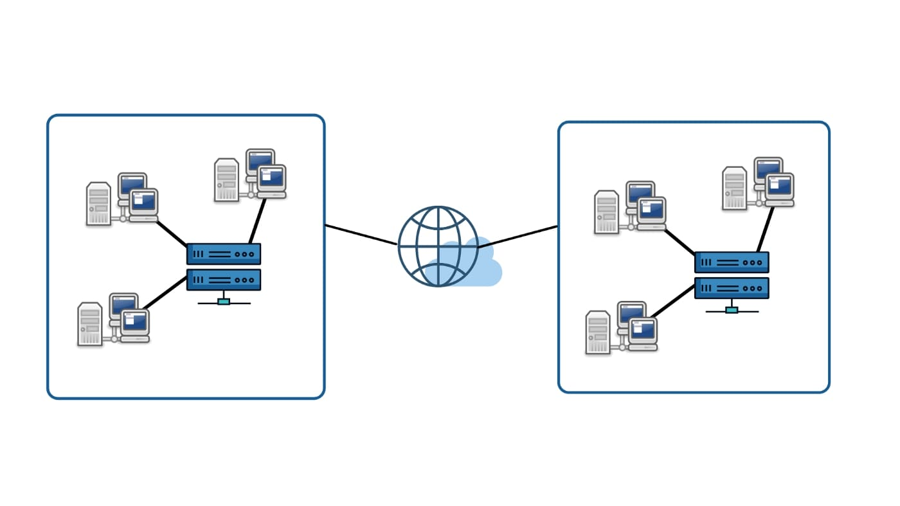
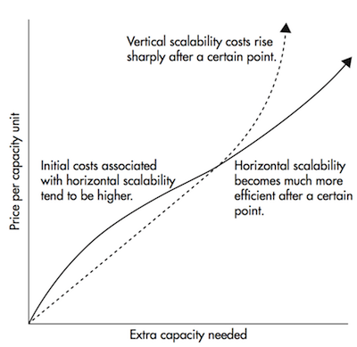

# Hệ thống phân tán

## Giới thiệu

Sự phát triển của công nghệ và nhu cầu mở rộng hệ thống tăng cao đã mở đường cho sự phát triển của một khái niệm gọi là Tính toán phân tán. Ngày nay, hầu hết ứng dụng quy mô lớn đều dựa trên tính toán phần tán, thế nên các hệ thống phân tán trở thành cốt lỗi của thiết kế các dịch vụ quy mô lớn, khả năng mở rộng cao và độ trễ thấp.

Bài viết này sẽ giới thiệu các chức năng cơ bản của hệ thống phần tán, và cách áp dụng chúng trong thế giới thực. Bây giờ ta sẽ đi vào tìm hiểu cách hoạt động của nó khi thiết kế hệ thống

## Hệ thống phân tán là gì?

Một hệ thống phân tán là một tập hợp các máy làm việc độc lập với nhau bằng toạ độ và tương tác với các máy khác để đạt được mục đích chung. Hệ thống này thường xuyên hoạt động, cung cấp khả năng mở rộng cao và nếu một thành phần sập thì sẽ không ảnh hưởng đến hiệu suất của toàn hệ thống.

Hệ thống phân tán cung cấp cho người dùng cuối một đối tượng duy nhất. Nó cho phép chia sẻ tài nguyên, dung sai phân vùng, tính đồng thời, khả năng mở rộng và tính trong suốt.

## Tại sao lại là hệ thống phân tán?

Hệ thống phân tán được tạo thành từ nhiều máy tính kết nối trong cùng một mạng, có bộ nhớ cục bộ và thông điệp giao tiếp. Do đó hệ thống này bao gồm nhiều thành phần phức tạp hơn. Và một câu hỏi thông thường là: "Tại sao ta cần dùng hệ thống phân tán nếu các hành vi của nó như quản lý, triển khai hay sửa lỗi đều phức tạp hơn?".

Lợi ích chính của hệ thống phần tán trong hầu hết phần mềm hiện nay là nó cung cấp khả năng mở rộng dịch vụ cao. Hệ thống phân tán cho phép ta thêm nhiều server vào dịch vụ để thực hiện việc **mở rộng theo chiều ngang**.

Các hệ thống truyền thống thưởng mở rộng theo chiều dọc, để tăng khả năng của một máy tính duy nhất bằng cách nâng cấP nó nhiều lần. Các dịch vụ mở rộng theo chiều dọc thường không tương thích với các thao tác mở rộng lớn, vì nó đắt đỏ và dễ dẫn đến điểm lỗi duy nhất (single point of failure). Bên cạnh đó thì việc mở rộng theo chiều ngang giúp ta tránh được các hạn chế đó. Nếu có bất kỳ sự suy giảm hiệu suất nào, bạn chỉ cần thêm nhiều máy vào, để dịch vụ có thể nhanh hơn mà không cần tốn nhiều chi phí như mở rộng theo chiều dọc. Hình bên dưới mô tả chỉ phí của công ty cho mở rộng theo chiều ngang và dọc.

Cùng với mở rộng hệ thống phân tán còn cung cấp dịch vụ độ trễ thấp và dung sai phân vùng. Hầu hết dịch vụ có khả năng mở rộng cao đều tốn chi phí cho việc đọc dữ liệu và làm giảm hiệu suất của hệ thống. Để xử lý điều này, hệ thóng phần tán sao chép các server. Điều này cung cấp dịch vụ với độ khả dụng cao và đảm bảo các hành vi dung sai phân vùng.

