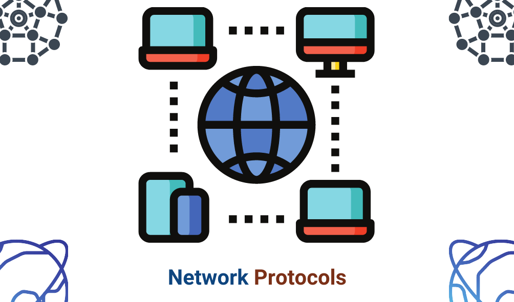
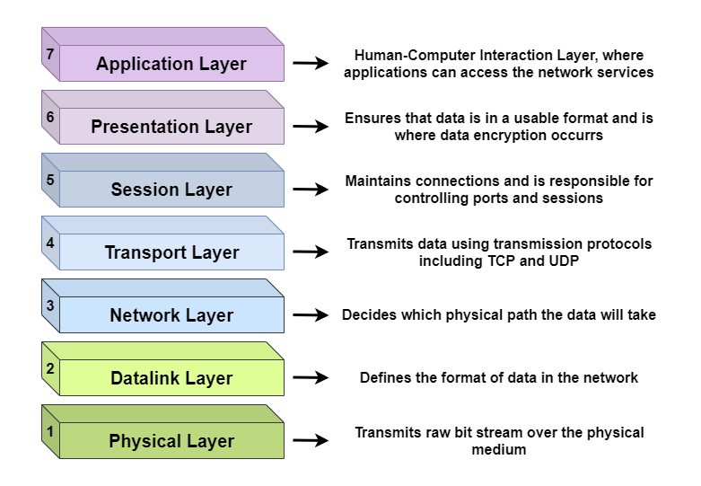

# Giao thức mạng

Một mạng máy tính xác định một tập hợp các máy tính và các thiết bị kết nối khác theo nhiều cách để trao đổi dữ liệu. Nó là một nhóm các máy tính có thể sử dụng một giao thức tiêu chuẩn qua kết nối kỹ thuật số để chia sẻ tài nguyên.

## Giao thức mạng là gì?

Một giao thức mạng là một tập hợp các quy tắc xác định cụ thể cách dữ liệu được truyền tải trên cùng một mạng giữa các thiết bị khác nhau. Nhìn chung, nó cho phép các thiết bị được kết nối tương tác với nhau, không phân biết bất kỳ kiểu tiến trình nội bộ, cấu hình hay cấu trúc của chúng.

## Mô hình OSI

Mô hình OSI (Open Systems Interconnection) mô tả 7 tầng để các hệ thống máy tính có thể giao tiếp qua mạng. Mỗi tầng biểu diễn một kiểu chức năng mạng khác nhau.

Các chức năng mạng này được thực hiện bởi giao thức mạng. Ví dụ, để chỉ thị nguồn của gói dữ liệu* và đích đến của nó, **Internet Protocol (IP)** đảm nhiệm việc định tuyến dữ liệu. IP cho phép giao tiếp network-to-network. Do đó nó là một giao thức ở tầng Network (tầng 3).

Một ví dụ khác, **Transmission Control Protocol (TCP)** đảm bảo việc truyền tải dữ liệu gói dữ liệu qua mạng một cách mượt mà. Do đó, TCP là giao thức ở tầng Transport (tầng 4).

Lưu ý: Một packet (gói dữ liệu) là một phân đoạn nhỏ của một thông điệp lớn. Dữ liệu được truyền tải qua mạng máy tính như Internet sẽ được phân tách thành các packet. Hệ thống tập hợp chúng và gộp các packet này lại.

## Giao thức mạng

