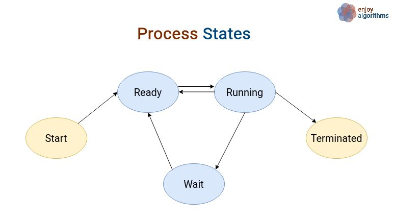
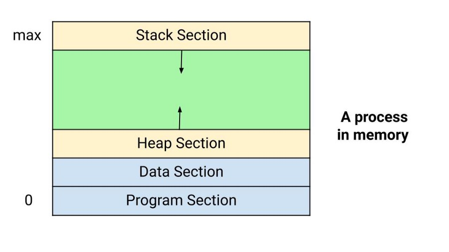
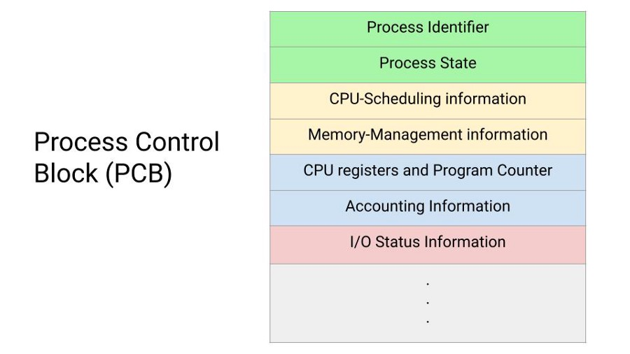
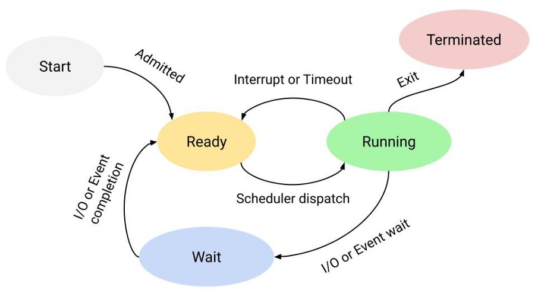

# Quản lý tiến trình trong hệ điều hành

Trong bài viết này, chúng ta sẽ tìm hiểu cách quản lý tiến trình trong hệ điều hành và các thuật toán liên quan đến nó. Trước khi đi sâu vào tìm hiểu cách quản lý tiến trình thì trước hết ta sẽ xem qua định nghĩa và các khía cạnh liên quan của nó.

Hiểu đơn giản thì một chương trình đang thực thi được gọi là **tiến trình**, hay nói cách khác, tiến trình là một thực thể của chương trình đang chạy, thực thể này có thể được gán và thực thị bởi một trình xử lý. Hai phần tử cốt lỗi của một tiến trình là code của chương trình và tập dữ liệu liên quan đến đoạn code đó.

**Bộ nhớ tiến trình (process memory)** được chia làm bốn phần:
- Phần *program* lưu trữ code của chương trình, đọc từ bộ nhớ điện tĩnh (non-volatile storage) khi chương trình được khởi động. 
- Phần *data* lưu trữ biến toàn cục và biến tĩnh, được cấp phát và khởi tạo trước khi thực thi chương trình chính.
- Phần *heap* được dùng cho quản lý cấp phát bộ nhớ động trong chương trình. Nói cách khác, nó là một phần của bộ nhớ khi thực hiện cấp phát động ví dụ như cấp phát thông qua `new` hay `malloc` và giải phóng thông qua `delete` hay `free`,...
- Phần *stack* lưu trữ biến cục bộ được đinh nghĩa bên trong hàm. Không gian trong stack được tạo cho biến cục bộ khi chúng được khai báo và phần không gian này được giải phóng khi ra khỏi phạm vi của nó.

## Process Control Block (PCB)

Một chương trình thực thi như một tiến trình được xác định duy nhất bởi các tham số khác nhau. Các tham số này được lưu trữ trong Process Control Block (PCB) cho mỗi tiến trình. Nó là một cấu trúc dữ liệu lưu trữ các thông tin như sau:
- **Identifier/Process Id**: một định danh duy nhất hay ID liên kết với tất cả tiến trình để phân biệt một tiến trình với các tiến trình khác.
- **Process State**: trạng thái tiến trình có thể là `ready`, `running`, `halted`, `completed`,...
- **CPU-Scheduling**: độ ưu tiên so với các tiến trình khác và con trỏ đến hàng đợi định thời (scheduling queues).
- **CPU register và Program Counter**: cần cho lưu trữ và phục hồi khi hoán đổi các tiến trình trong và ngoài CPU.
- **I/O status**: bao gồm các yêu cầu I/O chưa giải quyết, I/O của thiết bị được gán cho tiến trình này, một danh sách các file được sử dụng bởi tiến trình.
- **Memory-Management**: bảng trang hoặc bảng phân đoạn.
- **Accounting Information**: dung lượng CPU sử dụng cho thực thi tiến trình, giới hạn thời gian,...

## Trạng thái của tiến trình

Bây giờ, ta sẽ tìm hiểu về tiến trình, khi ta định nghĩa một tham số của tiến trình được gọi là State. Các tiến trình có thể có một trong 5 trạng thái là: start, ready, running, wait và terminated.

Bây giờ ta sẽ tìm hiểu về cách chuyển đổi trạng thái của chúng:
- **Null -> Start**: khi một tiến trình được tạo, nó được bảo rằng tiến trình đã được khởi tạo hoặc một tiến trình từ trạng thái NULL trở thành một trạng thái mới.
- **Start -> Ready**: hệ điều hành sau đó chuyển một tiến trình từ trạng thái Start sang trạng thái Ready, khi nó chuẩn bị để nhận. Ở giai đoạn này, tiến trình có tất cả tài nguyên khả dụng cần có để chạy với đang chờ đợi để CPU có thời gian thực thi nó.
- **Ready -> Running**: ở chuyển đổi này, hệ điều hành chọn một trong các tiến trình ở trạng thái Ready sử dụng bộ định thời tiến trình hoặc dispatcher. Sau đó CPU bắt đầu thực thi tiến trình đã chọn ở trạng thái running.
- **Running -> Terminated**: tiến trình đang chạy hiện tại bị huỷ bởi hệ điều hành nếu tiến trình được đề cập đã hoàn thành.
- **Running -> Ready**: tập định thời chỉ định giới hạn thời gian cho thực thi bất kỳ tiến trình đang hoạt động nào. Nhưng nếu tiến trình hiện tại nhiều hơn thời gian chỉ định bởi bộ định thời, nó sẽ được chuyển lại trạng thái ready. Lý do chính cho chuyển đổi này là để đạt được khoảng thời gian tối đa cho việc thực thi không bị gián đoạn. Hầu hết các hệ điều hành đa chương trình đều bắt buộc ràng buộc thời gian này.
- **Running -> Wait**: nếu một tiến trình muốn bất kỳ thứ gì đó nó phải đợi.