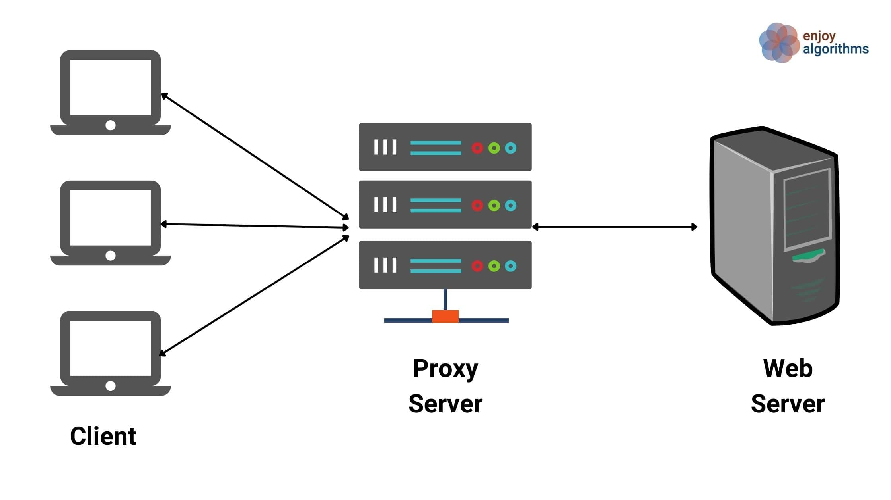
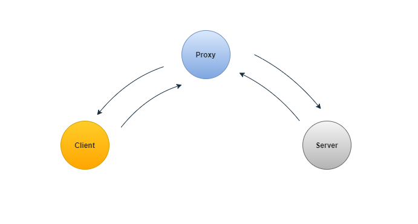
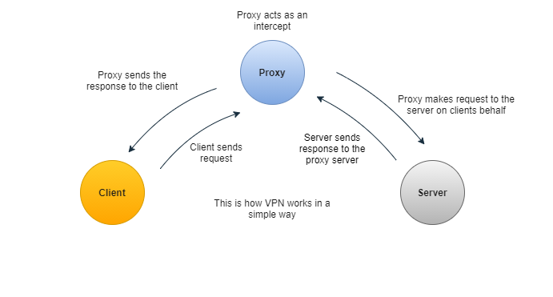
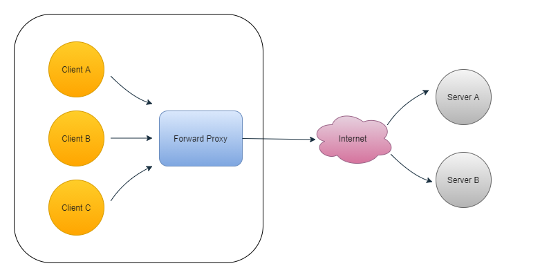
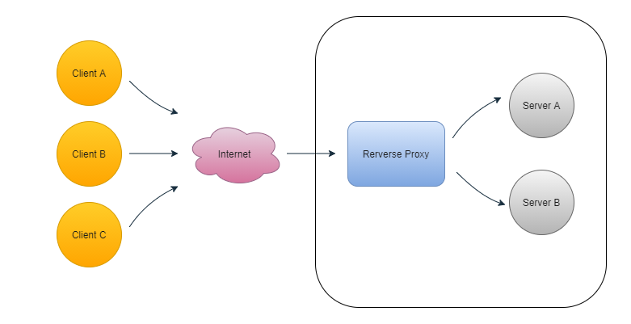
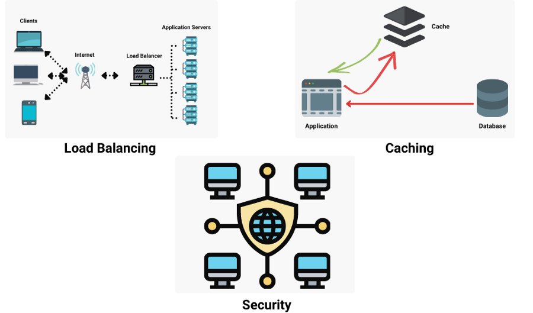
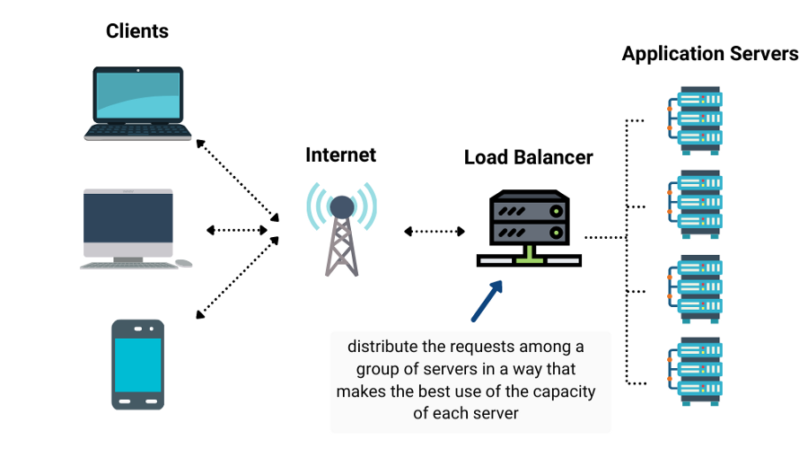

# Proxy Server

Trong bài viết này ta sẽ học về Proxy, một khái niệm quan trọng trong các câu hỏi phổ biến nhất về phỏng vấn thiết kế hệ thống. Nhiều người trong chúng ta đã sử dụng các công cụ này để giúp duy trì sự riêng tư hoặc tính ẩn danh của mình hoặc để giữ an toàn trước những kẻ thứ ba nghe trộm kết nối của chúng ta. Bạn có biết nó hoạt động như thế nào và nó hữu ích như thế nào không? Hãy cùng tìm hiểu!

## Proxy là gì?

Proxy về cơ bản là một server đóng vai trò trung gian giữa một client và một server khác. Khi các máy client gửi yêu cầu đến các trang web trên Internet, proxy server sẽ chặn các yêu cầu này, sau đó giao tiếp với server thay mặt cho các máy client này, giống như một bước chuyển tiếp cho phép chúng ta thực hiện điều gì đó trước hoặc sau khi yêu cầu được chuyển đến đích gốc.

## Proxy hoạt động như thế nào?

Một proxy hoạt động thay mặt cho một hoặc một nhóm client. Khi client muốn giao tiếp với server, giả sử proxy đã được client xác định cấu hình chính xác, khi client đưa ra yêu cầu tới server, thay vì trực tiếp đến server, nó sẽ đi tới proxy, sau đó sẽ chuyển tiếp yêu cầu đến server. Vì vậy, về cơ bản, điều sẽ xảy ra là một ứng dụng client đưa ra một yêu cầu có nghĩa là đi tới server nhưng trước tiên đi tới proxy để giao tiếp với server thay mặt cho clients.

## Proxy được dùng ở đâu?

Proxy không chỉ được sử dụng để ẩn danh tính của client khỏi server, mà thay vào đó nó còn có nhiều cách sử dụng khác.
1. Máy proxy được sử dụng để quản lý các yêu cầu và phản hồi.
2. Nó được sử dụng để lọc, ghi log và chuyển đổi các yêu cầu bằng cách thêm và xóa các tiêu đề.
3. Nếu một số máy client truy cập vào một tài nguyên cụ thể, proxy có thể lưu vào bộ nhớ cache và phản hồi cho tất cả các client mà không cần gửi yêu cầu đến server nhiều lần.
4. Nó cũng được sử dụng như một bộ cân bằng tải giữa các server.

## Forward Proxy 

Forward Proxy thường gọi nhanh là proxy, là một proxy nằm giữa client và server. Hãy để xem xét một ví dụ:

Ở đây, thay vì gửi yêu cầu trực tiếp đến server, các yêu cầu được gửi đến một proxy chuyển tiếp, sau đó sẽ gửi yêu cầu đến server.

Các forward proxy được sử dụng như một người trung gian thay vì tương tác trực tiếp với các server vì nhiều lý do như để tránh các hạn chế duyệt web, để truy cập nội dung bị chặn hoặc để bảo vệ danh tính trực tuyến của họ.

## Reverse Proxy

Reverse Proxy là một proxy nằm giữa một hoặc nhiều server. Các proxy này hoàn toàn trái ngược với forward proxy về mô hình tương tác của chúng. Một forward proxy hoạt động thay mặt cho client, trong khi đó reverse proxy hoạt động thay mặt cho server.

Trong trường hợp này, khi một client gửi một yêu cầu đến server, yêu cầu thực sự đi đến Reverse Proxy mà client không biết về nó. Client nghĩ rằng nó đang tương tác trực tiếp với server và đối với client, không có server nào khác ở đây và nó nghĩ rằng server mà nó đang tương tác là server mà nó muốn gửi yêu cầu. Chúng ta hãy lấy một ví dụ:

> "Giả sử, nếu chúng tôi nhập https://www.enjoyalgorithm.com trong trình duyệt của mình, trình duyệt của chúng tôi thực hiện truy vấn DNS để lấy địa chỉ IP của https://www.enjoyalgorithm.com. Nếu https://www.enjoyalgorithm.com sử dụng reverse proxy và cấu hình chính xác, truy vấn DNS sẽ trả về địa chỉ IP của reverse proxy".

Hiện tại, reverse proxy rất tiện lợi khi chúng ta thiết kế một hệ thống phức tạp và nó có thể được sử dụng cho nhiều mục đích, chẳng hạn như:

1. Bảo mật: Khi chúng tôi sử dụng reverse proxy, địa chỉ IP server gốc của trang web sẽ bị ẩn khỏi những kẻ tấn công. Vì vậy, để khai thác bất kỳ lỗ hổng nào, các client độc hại không thể truy cập trực tiếp vào chúng. Nhiều reverse proxy bao gồm các tính năng giúp bảo vệ backend chống lại các cuộc tấn công từ chối dịch vụ phân tán (DDoS), chẳng hạn như từ chối lưu lượng truy cập từ các địa chỉ IP cụ thể của client (danh sách đen) hoặc giới hạn số lượng yêu cầu được chấp nhận từ mỗi client.
2. Cân bằng tải: Một trang web với hàng triệu người dùng truy cập mỗi ngày có thể khó xử lý lượng truy cập khổng lồ như vậy với một server duy nhất. Thay vào đó, chúng tôi có thể sử dụng nhiều server và sử dụng reverse proxy như một giải pháp cân bằng tải để phân phối lưu lượng giữa các server và ngăn bất kỳ server nào bị quá tải.
3. Bộ nhớ đệm: Một reverse proxy cũng có thể được sử dụng để lưu các yêu cầu vào bộ đệm, dẫn đến hiệu suất nhanh hơn.

#### Nhược điểm của Reverse Proxy

Các reverse proxy không phải lúc nào cũng hữu ích và nó có những hạn chế riêng:
1. Thêm reverse proxy vào kiến trúc làm tăng độ phức tạp của hệ thống của chúng tôi.
2. Một reverse proxy duy nhất có thể hoạt động như một điểm lỗi duy nhất và việc thêm nhiều reverse proxy sẽ làm tăng độ phức tạp hơn nữa.
3. Khi chúng ta sử dụng các kết nối không được mã hóa tới proxy, server có thể sửa đổi các phản hồi mà chúng ta nhận được, dù tốt hay xấu.
4. Ngay cả sau khi sử dụng kết nối hoặc mạng được mã hóa, dữ liệu hoặc thông tin của chúng ta có thể bị rò rỉ bằng kỹ thuật kết nối được mã hóa **TLS và SSL**

## Reverse Proxy so với Load Balancer

Reverse proxy và bộ cân bằng tải là các thành phần trong thiết kế hệ thống client-server. Trong tương tác giữa client và server, cả hai đều đóng vai trò trung gian, thực hiện các chức năng tăng cường hiệu quả.

Bộ cân bằng tải phân phối các yêu cầu client đến giữa một nhóm server, trả lại phản hồi cho client thích hợp từ server đã chọn trong từng trường hợp. Khi một trang web cần nhiều server, bộ cân bằng tải thường được triển khai nhất vì khối lượng yêu cầu quá nhiều để xử lý hiệu quả cho một server duy nhất. Một điểm lỗi duy nhất cũng bị loại bỏ bằng cách triển khai nhiều server. Công việc của bộ cân bằng tải là phân phối các yêu cầu theo cách sử dụng tốt nhất khả năng của từng server, tránh quá tải trên bất kỳ server nào và dẫn đến phản hồi nhanh nhất có thể cho client.

### Cân bằng tải

Một reverse proxy chấp nhận một yêu cầu từ một client hoặc một nhóm client, chuyển tiếp nó đến một server và trả lại phản hồi của client từ server. Trong khi việc triển khai bộ cân bằng tải chỉ có ý nghĩa khi bạn có nhiều server, thì thậm chí chỉ với một web server hoặc app server, việc triển khai proxy vẫn có ý nghĩa.