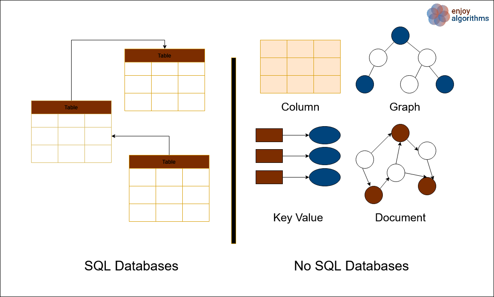

# SQL vs NoSQL

Bạn đã bao giờ rơi vào thế tiến thoái lưỡng nan khi phải chọn một kiểu lưu trữ phù hợp cho ứng dụng của mình? Kiểu lưu trữ đó có khả thi với các vấn đề nghiệp vụ mong đợi và cung cấp dịch vụ hiệu quả không? Nếu bạn đang băn khoăn về điều đó thì bài viết này dành cho bạn. Bài viết này đưa ra các góc nhìn hoàn chỉnh khi thiết kế cơ sở dữ liệu để ứng dụng của bạn hoạt động hiệu quả.

Ngày nay, hầu hết doanh nghiệp đều xử lý và quản lý một lượng dữ liệu khổng lồ. Quyết định cốt lõi đằng sau việc chọn kiểu cơ sở dữ liệu dựa trên logic nghiệp vụ trong ứng dụng, các chức năng cốt yếu của hệ thống, cấu trúc dữ liệu của hệ thống và các yêu cầu khác. Nhân tố chính cho chọn cơ sở dữ liệu là cấu trúc dữ liệu và các mối quan hệ với nó. Nhưng khi đi sâu vào chọn cơ sở dữ liệu phù hợp, cần phải hiểu rõ cấu trúc và chức năng của từng kiểu cơ sở dữ liệu. Hầu hết cơ sở dữ liệu đều được phân loại thành SQL và NoSQL.

## Cơ sở dữ liệu SQL

SQL (Structured Query Language) là ngôn ngữ lập trình dùng cho các cơ sở dữ liệu quan hệ. SQL là cơ sở dữ liệu dạng bảng, nó bao gồm nhiều bảng, mỗi bảng bao gồm hàng và cột. Cơ sở dữ liệu quan hệ có lược đồ xác định trước. Một lược đồ là một mối quan hệ giữa bảng và các kiểu trường. Về bản chất nó là một công cụ giữ cho dữ liệu được đồng bộ hoá và tối thiểu hoá dữ liệu dư thừa.

Cơ sở dữ liệu quan hệ với thuộc tính ACID. Do đó kiểu cơ sở dữ liệu này được ưa thích hơn với các hệ thống hướng giao dịch (transaction-oriented) và lưu trữ dữ liệu tài chính. Các thuộc tính ACID cung cấp dịch vụ error-free ngay cả trường hợp bị lỗi, điều này là cần thiết cho tính hợp lệ của các giao dịch.

Các cơ sở dữ liệu SQL là: MySQL, Oracle, PostgreSQL, MariaDB, IBM DB2,...

## NoSQL

NoSQL là hệ thống cơ sở dữ liệu phi quan hệ, nó rất linh hoạt và dễ dàng mở rộng. Cơ sở dữ liệu NoSQL cung cấp lược đồ dữ liệu động và phù hợp nhất cho lưu trữ dữ liệu phi cấu trúc như các bài viết, video, ảnh trên mạng xã hội và các kiểu dữ liệu phi cấu trúc khác. Các kiểu cơ sở dữ liệu NoSQL bao gồm bộ lưu trữ key-value, cơ sở dữ liệu hướng tài liệu (document oriented), cơ sở dữ liệu hướng cột (column oriented), cơ sở dữ liệu đồ thị. Cơ sở dữ liệu NoSQL không phù hợp với các truy vấn phức tạp.

Vì khả năng phân tán cao và linh hoạt, cơ sở dữ liệu NoSQL phù hợp cho các framework đời mới như Hadoop và big data hay các dịch vụ xử lý real-time. Cơ sở dữ liệu NoSQL cung cấp thuộc tính BASE vì cơ sở dữ liệu NoSQL cung cấp độ linh hoạt cao. NoSQL phù hợp cho lưu trữ dữ liệu phân cấp và giải quyết các vấn đề về dữ liệu khả dụng.

Các cơ sở dữ liệu NoSQL là MongoDB, Redis, Neo4j, Cassandra, Hbase.

## Tại sao dùng cơ sở dữ liệu SQL?

Cơ sở dữ liệu SQL được dùng khi:
1. Dữ liệu có cấu trúc cao và ít khi yêu cầu cập nhật.
2. Dữ liệu được đảm bảo tính toán vẹn
3. Dịch vụ phù hợp cho các truy vấn phức tạp.
4. Các thuộc tính ACID là rất cần thiết.

## Tại sao dùng cơ sở dữ liệu NoSQL?

Cơ sở dữ liệu NoSQL được dùng khi:
1. Phù hợp với các hệ thống linh hoạt, dễ mở rộng và nhanh chóng.
2. Kích cở dữ liệu lớn, và dữ liệu có lược đồ dữ liệu động.
3. Thuộc tính ACID là không cần thiết.
4. Dịch vụ yêu cầu kiến trúc phân tán và tính toán đám mây.
5. Hệ thống yêu cầu phát triển mở rộng.

## Mở rộng

Để xử lý sự gia tăng lưu lượng truy cập hiệu quả, ta cần mở rộng hệ thống. Mở rộng giúp cải thiện thông lượng hệ thống và cung cấp độ trễ tối thiểu. Tuy nhiên, SQL và NoSQL có cách mở rộng khác nhau.

Mở rộng theo chiều ngang nghĩa là thêm nhiều máy hơn vào hệ thống. Còn mở rộng theo chiều dọc là tăng khả năng của máy để có thể xử lý lưu lượng truy cập lớn.

Cơ sở dữ liệu SQL cung cấp khả năng mở rộng theo chiều dọc trong khi NoSQL cung cấp khả năng mở rộng theo chiều ngang. Trong SQL, dữ liệu có cấu trúc rất cao do đó khi mở rộng, ta cần duy trì cấu trúc của dữ liệu. Thế nên để duy trì tính toàn vẹn của dịch vụ, cơ sở dữ liệu SQL được thiết kế cho chạy trên một server duy nhất.

Trong cơ sở dữ liệu NoSQL, nó không cần duy trì cấu trúc dữ liệu, do đó các kiểu hệ thống dễ dàng mở rộng theo chiều ngang với các máy độc lập lẫn nhau. Do đó để mở rộng hệ thống, ta có thể thêm một hay nhiều server để tăng năng lực của dịch vụ.

## So sánh cả hai

Khi độ phức tạp của hệ thống tăng lên, thỉnh thoảng nó sẽ dùng cả hai kiểu cơ sở dữ liệu cho các công việc khác nhau trong dịch vụ. Ví dụ, Youtube lưu trữ nội dung video trong cơ sở dữ liệu NoSQL và lưu trữ metadata của người dùng và các thông tin khác trong SQL. Do đó, với vài yêu cầu nghiệp vụ ta có thể tích hợp cả hai kiểu dịch vụ và sử dụng chúng kết hợp với nhau bằng cách lấy đặc điểm tốt nhất của từng cơ sở dữ liệu.

Các cơ sở dữ liệu cung cấp hai kiểu dịch vụ như MySQL Document Store cung cấp cấu trúc của cơ sở dữ liệu SQL và tính năng sự linh hoạt của cơ sở dữ liệu NoSQL. Tương tự, MongoDB là cơ sở dữ liệu NoSQL, vẫn cung cấp các giao dịch ACID.

## Cuối cùng

Việc chọn cơ sở dữ liệu phụ thuộc vào kiểu của ứng dụng và kiểu dịch vụ nó cung cấp. Tuy nhiên, không có cơ sở dữ liệu nào phụ hợp với mọi yêu cầu. Các khía cạnh nghiệp vụ khác nhau sẽ yêu cầu cơ sở dữ liệu quan hệ hoặc phi quan hệ thậm chí là cả 2. Cơ sở dữ liệu SQL phù hợp với các ứng dụng mà cấu trúc dữ liệu cần đảm bảo tính toàn vẹn và lược đồ dữ liệu phải được xác định rõ ràng. Trong khi cơ sở dữ liệu NoSQL phù hợp với các ứng dụng tập trung vào tốc độ và khả năng mở rộng.

Với các công nghệ mới, tiến trình real-time và hệ thống phân tán cao cơ sở dữ liệu NoSQL đang dần trở nên phổ biến. Nhưng cuối cùng việc chọn cơ sở dữ liệu vẫn phụ thuộc vào ứng dụng. Ta sẽ cần biết tất cả các trường hợp liên quan khi đi cùng với bất kỳ kiểu kiến trúc cụ thể nào.

# Nguồn 

[enjoyalgorithms](https://www.enjoyalgorithms.com/blog/sql-vs-nosql)